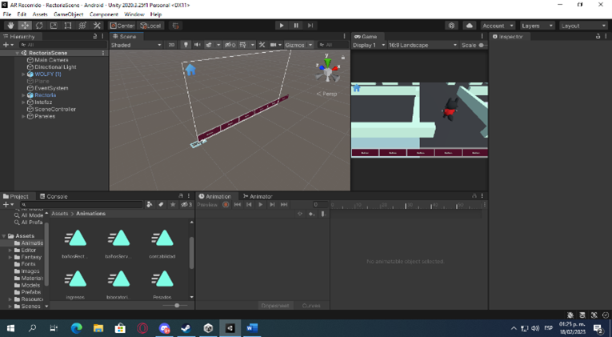
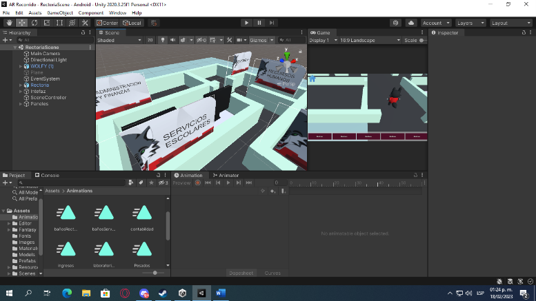
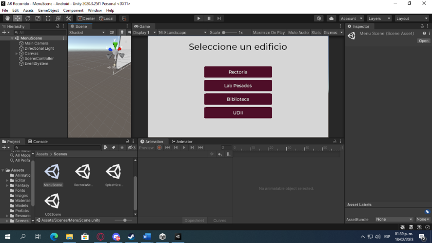
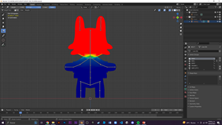

# Unity-AR-Recorrido 🇦🇷

Este repositorio contiene un proyecto de Unity basado en la plataforma móvil, que utiliza el motor de juego Unity Engine en su versión 2020.3.25f1 y el SDK de terceros Vuforia Engine para la creación de un recorrido virtual de una institución llamada UTVAM.

## Descripción del proyecto 📝

El proyecto consiste en un recorrido virtual por el campus de la institución UTVAM, en el cual se deben encontrar diferentes zonas dentro de los edificios del campus. La experiencia de usuario es enriquecida gracias a la realidad aumentada, la cual se implementa a través del uso de Vuforia Engine.

 
 
 

## Requisitos 🛠️

Para poder utilizar y ejecutar este proyecto se necesitan los siguientes requisitos:

-   Unity Engine versión [2020.3.25f1](https://unity.com/releases/editor/whats-new/2020.3.25) o superior. 
-   SDK de terceros [Vuforia Engine](https://developer.vuforia.com/downloads/sdk).
-   Windows o macOS.
-   [Git](https://git-scm.com/downloads) instalado.
-   [LFS](https://docs.github.com/en/repositories/managing-your-repositorys-settings-and-features/managing-repository-settings/managing-git-lfs-objects-in-archives-of-your-repository) (Git Large File Storage) en los atributos de Git.

## Herramientas modelado 3D 🧊

- Blender [descargar aquí](https://www.blender.org/download/) se utilizo para el modelado del personaje wolfy y las animaciones dentro de la aplicación.
 

## Instalación 📥

1.  Clonar el repositorio en tu máquina local utilizando Git:

    ```bash
    git clone https://github.com/DaveDeveloper117/Unity-AR-Recorrido.git
    ```

3.  Abrir el proyecto en Unity.
    
4.  Asegurarse de tener instalado el SDK de Vuforia Engine. Si no se encuentra instalado, se puede descargar desde su sitio oficial.
    
5.  Exportar el proyecto en un archivo APK utilizando Android SDK y NDK.
    
6.  Instalar el archivo APK en un dispositivo móvil compatible con Android.

## Contribuidores ❤️

- Eduardo Valam Matías Bautista ([@OmniSk8](https://github.com/OmniSk8))
- Marco Antonio Malagon Perdomo ([@SpartanTerra69](https://github.com/SpartanTerra69))

## Licencia 🔑

Este proyecto se encuentra bajo la licencia Creative Commons. Consulta el archivo [LICENSE](https://github.com/DaveDeveloper117/Unity-AR-Recorrido/blob/main/LICENSE) para más detalles.
